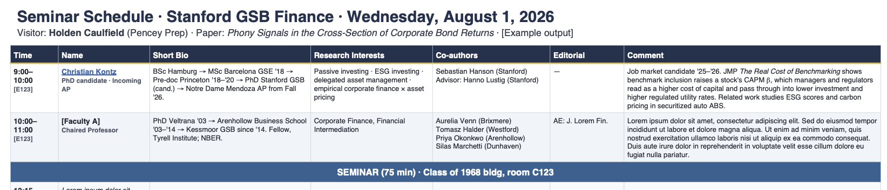

# seminar-schedule

<p align="center">
  
</p>

> **Turn a visitor's seminar-day schedule into a researched one-page briefing — in about the time it takes to grab coffee.**

A Claude Code skill that takes a schedule of one-on-one meetings (PDF, pasted table, or spreadsheet) and produces a polished single-page landscape PDF. Each row shows who you'll meet: PhD and career timeline, research interests, frequent co-authors, editorial roles, and what they're currently working on. Designed for the night before a seminar visit, when you have a dozen 30-minute slots ahead of you and no time to skim a dozen CVs.

---

## Example

The image above is page 1 of an illustrative example. The first row is a real enrichment; the remaining rows use placeholder content so this repo doesn't publish live research on identifiable people. The clickable PDF — names link to homepages — is in [`examples/example-output.pdf`](examples/example-output.pdf).

How the output is built: each attendee's homepage, CV, publications, and editorial pages are pulled live; bios are compressed into two-digit-year timelines; current working papers are surfaced in plain language in the `Comment` column; the whole thing is rendered as one landscape A4 page with themed rows for seminar, dinner, and PhD meeting slots.

---

## Installation

1. Download [`seminar-schedule.skill`](seminar-schedule.skill) from this repository.
2. In Claude Code: **Settings → Capabilities → Skills → Add**, then select the `.skill` file.

---

## Usage

Paste a schedule into Claude Code and ask for a briefing. The skill triggers on prompts like:

> *"Here's the schedule for my Stanford visit next Wednesday — can you prep me?"*

> *"Attached is a PDF schedule and my draft paper. Make me a briefing."*

For best results, also provide:

- the **draft paper** you're presenting (PDF or abstract), and
- your **homepage or CV URL**.

Both feed the `Comment` column, which is the single most useful part of the output.

---

## What it does

- **Parses** PDFs (including scanned), pasted tables, `.xlsx`, and `.csv`
- **Researches** every attendee via live web search — never training-data recall, because people move, change roles, and publish new work constantly
- **Builds** a compact bio timeline in two-digit years: `PhD Chicago '07 → UT Austin '07–'17 → Kellogg since '17`
- **Finds** frequent co-authors, editorial roles across JF / JFE / RFS / AER / QJE / JPE / ReStud, and — most importantly — current *working papers*, not just published ones
- **Renders** a single-page landscape A4 PDF with clickable name links, role subtext, and themed rows for seminar (marine blue), dinner (steel blue), and PhD meeting (light green) slots
- **Auto-shrinks** font and padding if the schedule is long enough to overflow a single page

---

## Limitations

- **Live research takes time.** A dozen attendees ≈ a few minutes of web search and fetch before the PDF is generated.
- **Web presence required.** Researchers with minimal online footprint (some PhD students, non-US institutions) get flagged with ⚠ rather than guessed.
- **Finance / economics bias.** Editorial-role lookups target finance and economics journals. Adjacent fields will need the journal list adapted in `SKILL.md`.
- **Name collisions** are disambiguated via affiliation; if still ambiguous the row is flagged rather than guessed.

---

## Files

```
seminar-schedule/
├── README.md                 # this file
├── LICENSE                   # MIT
├── seminar-schedule.skill    # installable bundle (zip)
├── seminar-schedule/
│   └── SKILL.md              # skill definition and workflow
└── examples/
    ├── example-output.pdf    # generated briefing (clickable links)
    └── example-output.png    # page 1 rendered as hero image
```

## License

MIT — see [`LICENSE`](LICENSE).
